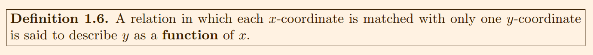
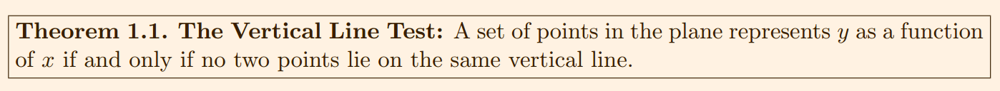
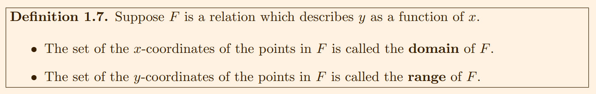
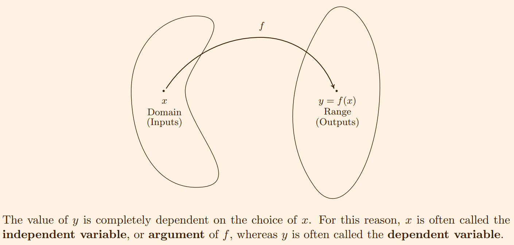
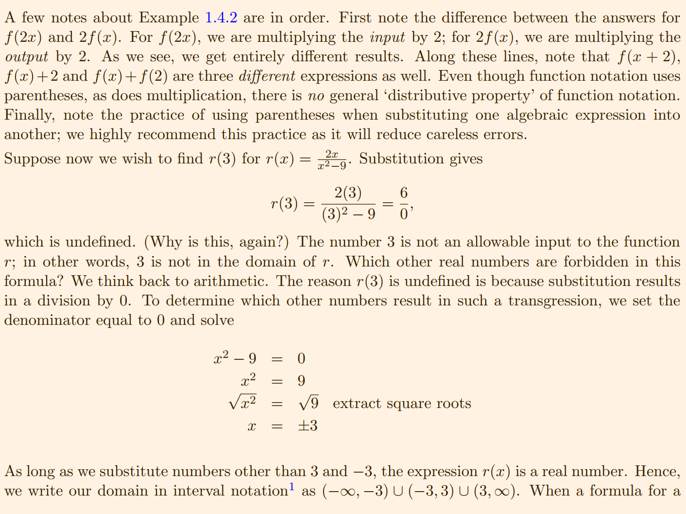
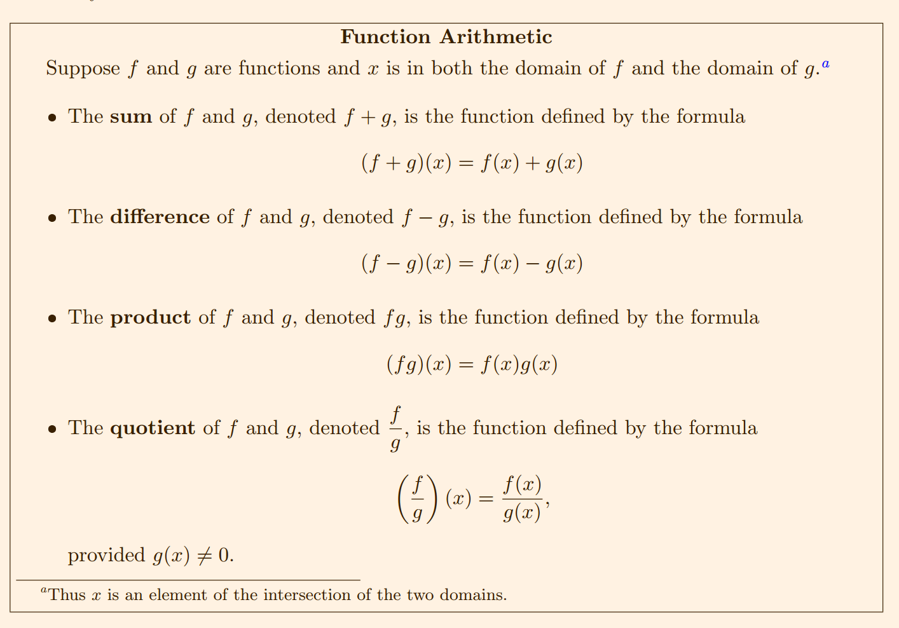

## <span style="color:red;">Introductions to Functions</span>

One of the core concepts in Collecge Algebra is the **function**




Suppose a relation F describes y as a function of x. The sets x- and y-coordinates are given special names which we define below



---

## <span style="color:red;">Function Notation</span>
If we think of the domain of a function as a set of **inputs** and the range as a set of **outputs**, we can think of a function f as a precess by which each input x is matched with only one output y. Since the out is completely determined by the input of the process f, we symbolize the output with **function notation** 'f(x)', read 'f' of 'x'. In other words, f(x) is the output which results by applying the process f to the input x.





When a formula for a function is given, we assume that the function is valid for all real numbers which make arithmetic sense when substituted into the formula. This set of numbers is often called the **implied domain** of the function. At this stage, there are only two mathematical sins we need to avoid: division by 0 and extracting even roots of negative numbers.


---

## <span style="color:red;">Function Arithmetic</span>
The following definitions allow us to add, substract, multiply and divide function using the arithmetic we already
know for real numbers



---

## <span style="color:red;">Graph of Functions</span>


---

## <span style="color:red;">Transformations</span>


## Note

```
Bằng một cách nào đó, một đẳng thức(Equation) có sự xuất hiện của 2 ẩn số
x và y. Ta có thể cho ra một tập hợp các cặp x và y thoã mãn đẳng thứ
(gọi là Relation).
ví dụ: 
  ta có các equation sau
  3x + y = 2
  x^2 + y^2 = 3


Khi ta dồn toàn bộ hằng số và x sang một vế và y sang vế còn lại của 
đẳng thức. Lúc đó ta có vế chứa x được gọi là hàm số(Function). Với một 
điều kiện, mỗi x tương ứng chỉ cho ra một và duy nhất một y, từ phương trình.
ví dụ: 
  ta có thể sinh ra các hàm số từ đẳng thức sau
  3x + y = 2 
  => y = 2 - 3x
  => dự kiến ta đã tìm ra một phương trình là f(x) = 2-3x
  Ta có với mỗi x thuộc tập R, thì f(x) chỉ cho ra duy nhất một và chỉ một 
  kết quả y
  => f(x) = 2-3x là một phương trình


Ta gọi x là tham số(Argument) hay các giá trị độc lập(Independent Variable).
Còn y được gọi là các giá trị phụ thuộc(Dependent Variable) vì nó phụ thuộc 
vào x.


Lưu ý: Từ điều kiện đã nhắc đến ở trên thì không phải đẳng thức nào cũng ẩn
chứa phương trình
ví dụ:
  x^2 + y^2 = 0 không thể cho ra phương trình
  vì khi x = 0 sẽ cho ra một lúc hai kết quả y


Ngoài ra không phải với mọi giá trị của x thì phương trình cũng có thể cho
ra kết quả y. Bới vì phương trình cũng bị giới hạn bởi các quy tắc toán 
học(arithmetic sense)
ví du:
  phương trình có căn thức, thì không được lấy căn của số âm
  phương trình có phân số, thì mẫu số phải khác không
Để phương trình hoạt động bình thường và không vi phạm các nguyên tắc toán
học thì x phải nằm trong một khoảng phạm vi nhất định (gọi là implied domain).

```