## Sets of Real Numbers and the Cartesian Coordinate Plane
---
### Set of Numbers
Definition of **Set** and describe Set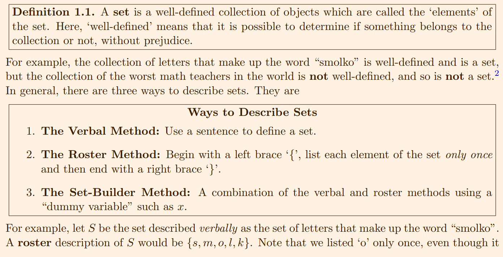

There is some Sets of Number 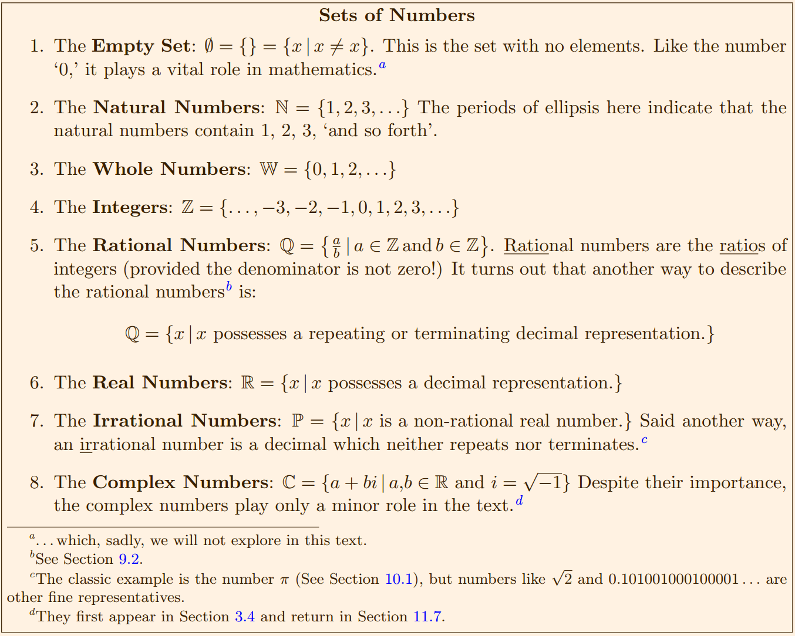
 
If we visualize R as a line. Segments of this line are called **intervals** of numbers. **Interval notation** associated with given sets of number 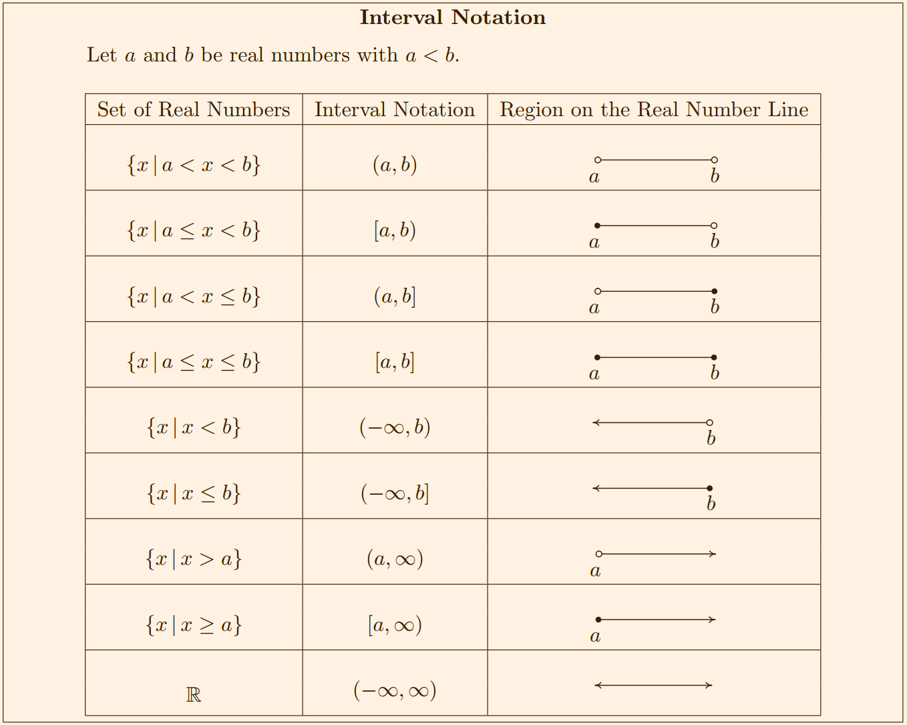

We will often have to combine sets. There are two basic way to combine set: **intersection** and **union** 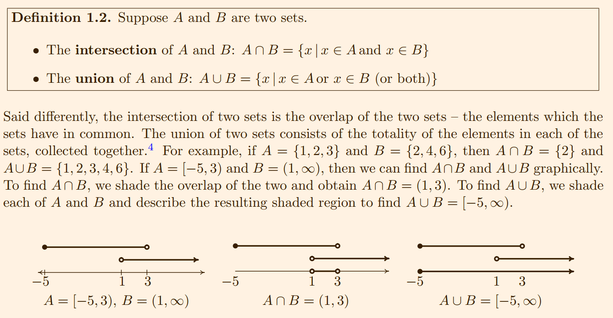

### The cartesian Coordinate Plane
In order to visualize the pure excitement that is Precalculus, we need to unite Algebra and Geometry. Simply put, we must find a way to draw algebraic things
Let's start with possibly the greatest mathematical achievement of all time: the **Cartesian Coordinate Plane**
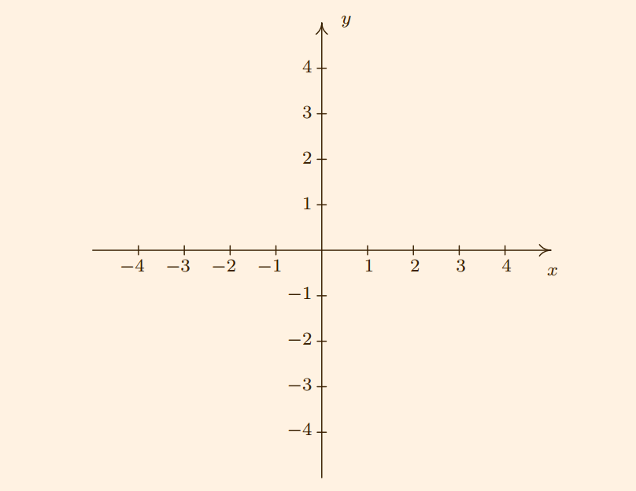
The horizontal number line is usually called the **x-axis** while the vertical number line is usually called the **y-axis**.
We then describe the point P using the **ordered pair** (2; −4). The first number in the ordered pair is called the **abscissa** or **x-coordinate** and the second is called the **ordinate** or **y-coordinate**.

The axes divide the plane into four regions called **quadrants**. They are labeled with Roman
numerals and proceed counterclockwise around the plane:
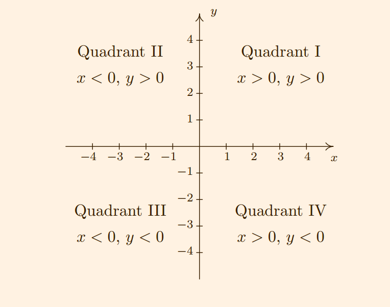

One of the most important concepts in all of Mathematics is **symmetry**. There are many types of
symmetry in Mathematics, but three of them can be discussed easily using Cartesian Coordinates.
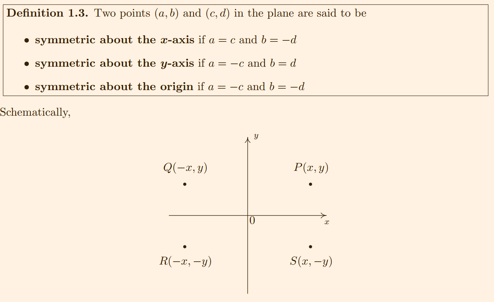

### Distance in the Plane
Another important concept in Geometry is the notion of length. If we are going to unite Algebra and Geometry using the Cartesian Plane, then we need to develop an algebraic understanding of what distance in the plane means.

Related to fuinding the distance between two points is the problem of finding the **midpoint** of the line segment connecting two points.
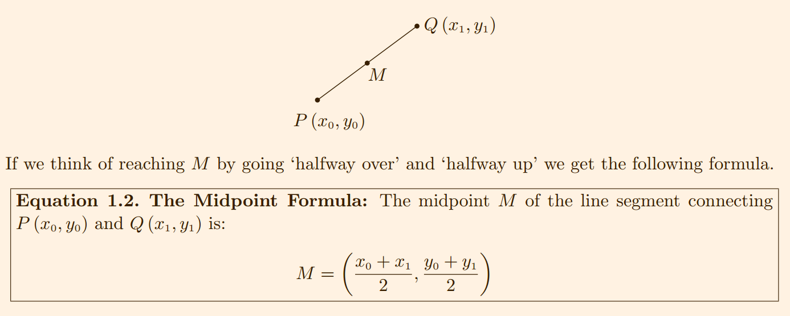

## Relations
---
A **Relation** is a set of points in the plane.
Consider the relation R = {(-2,1),(4,3),(0,-3)}. R is described using the roster method. Since R consists of points in the plane, we follow our instinct and plot the points. Doing so products the **graph** of R
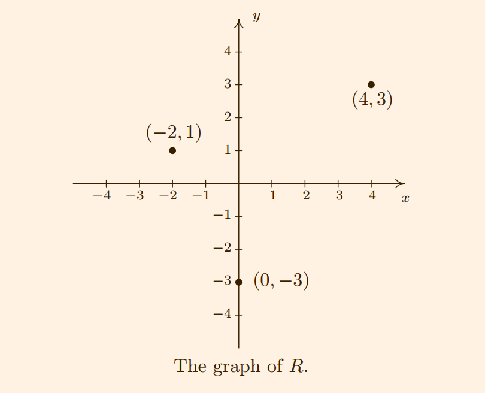

In the following example, we graph a variety of relations:
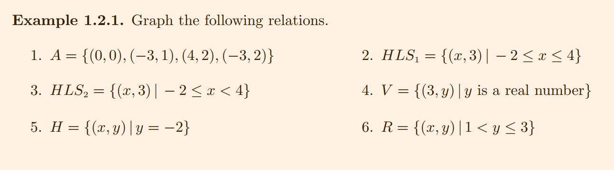
Here are solutions:
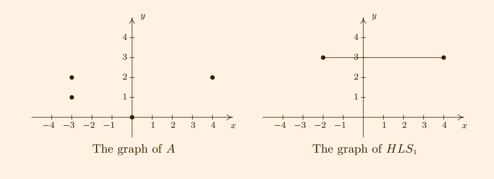
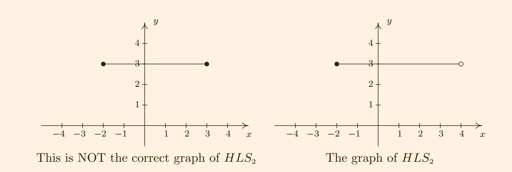
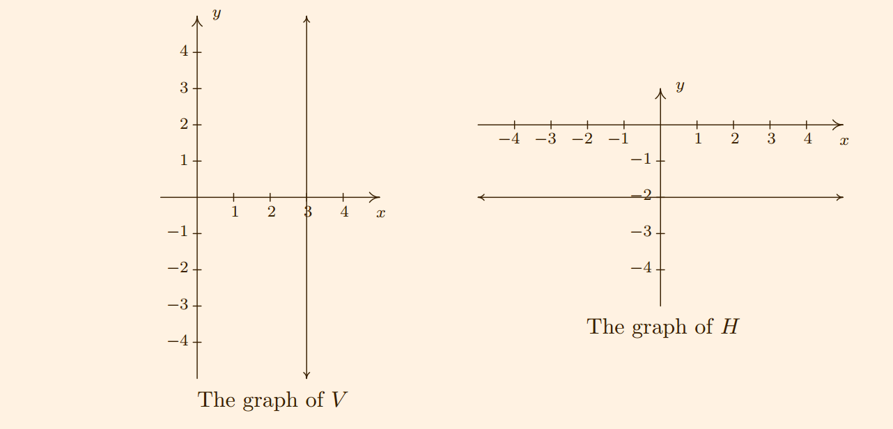
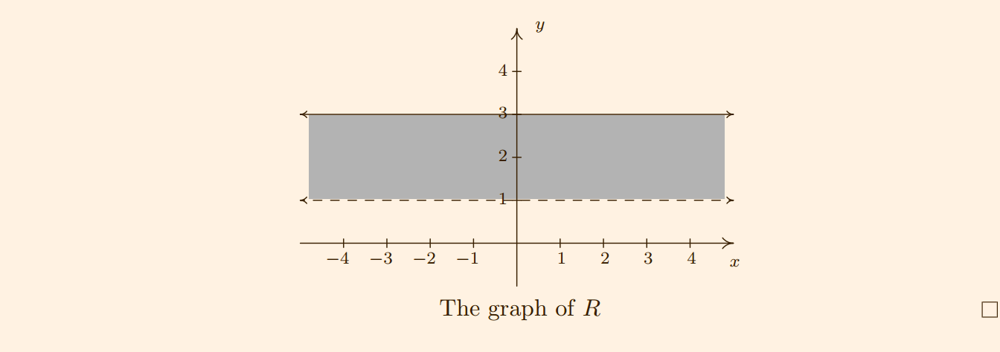

The relations V and H in the previous example lead us to our final way to describe relations: **algebraically**
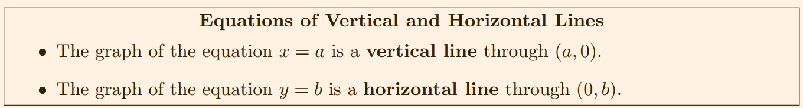

### Graphs of Equations
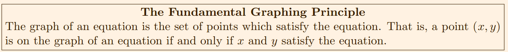
Hear, 'x and y satisfy the equation' means 'x and y make the equation true'

Example:
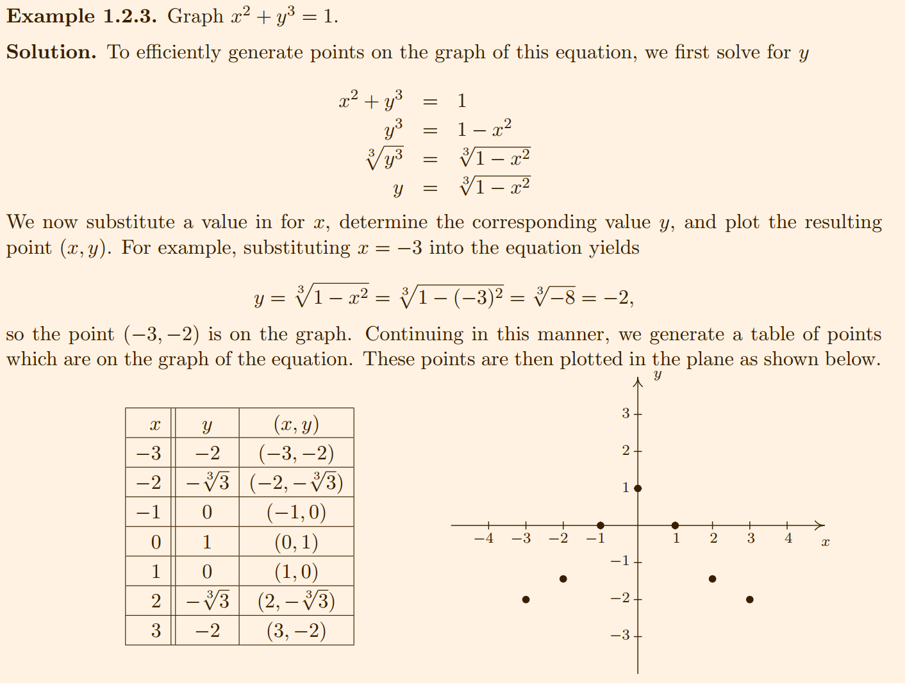
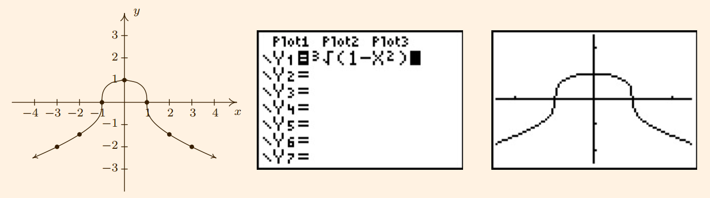

Of all of the points on the graph of an equation, the places where the graph croesses or touches the axes hold special significance. These are called the **intercepts** of the graph.

## Introductions to Functions
---

## Function Notation
---

## Function Arithmetic
---

## Graph of Functions
---

## Transformations
---

